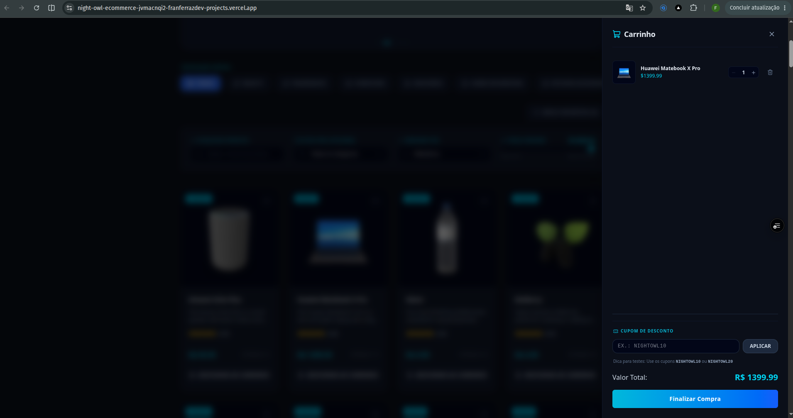
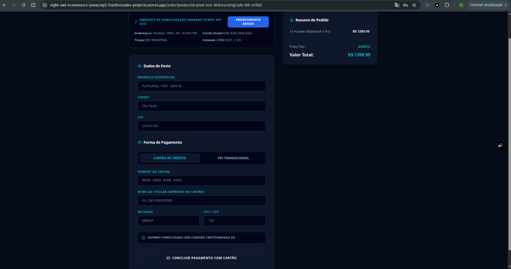
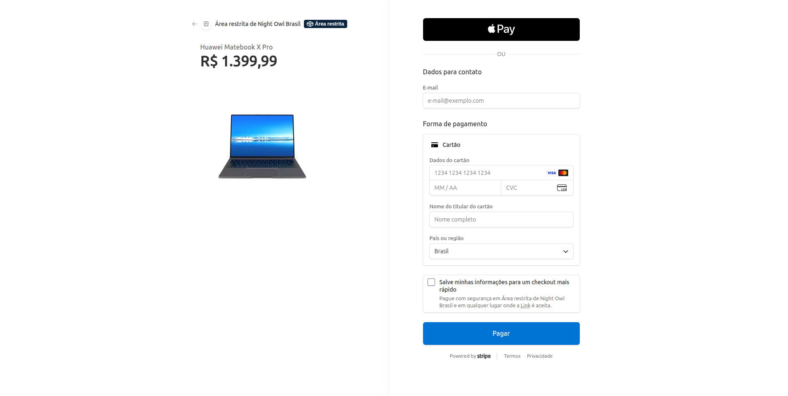
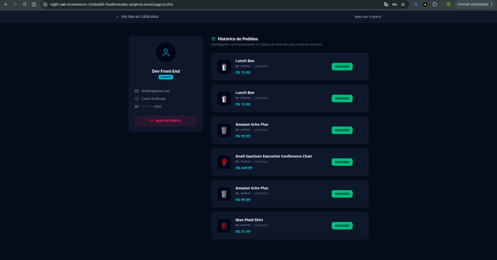

# Night Owl Store - High-Performance Transational E-commerce

## 🇧🇷 Versão em Português

Plataforma completa de e-commerce transacional de alta performance desenvolvida com Next.js 16, React 19 e Tailwind CSS v4. O projeto adota princípios rigorosos de Clean Architecture, gerenciamento de estado atomizado com Zustand, proteção de rotas privadas via Edge Middlewares e integração assíncrona com o gateway de pagamentos Stripe Sandbox, utilizando persistência relacional no PostgreSQL via Prisma ORM.

## 🔗 Demonstração em Tempo Real / Live Demo

👉 **Acesse o sistema no ar:** [Night Owl E-commerce](https://night-owl-ecommerce.vercel.app/)

### 📸 Galeria de Telas e Demonstrações Animadas (UI/UX)

As demonstrações e capturas abaixo ilustram o ecossistema completo em tempo de execução:

#### 1. Catálogo Principal, Vitrine Global e Sliders Interativos

<video src="public/readme-gallery/01-catalog-showcase.webm" autoplay loop muted width="100%" title="Navegação Dinâmica do Catálogo"></video>

#### 2. Carrinho Lateral Atomizado (Zustand Core Store)



#### 3. Página do Formulário de Pedidos (Checkout Dinâmico)



#### 4. Gateway de Pagamento Seguro Hospedado (Stripe Sandbox)



#### 5. Configuração de Sucesso Transacional e Automação de Rastreamento

<video src="public/readme-gallery/05-logistic-automation.webm" autoplay loop muted width="100%" title="Máquina de Estados Logística Sandbox"></video>

#### 6. Histórico de Pedidos e Área do Cliente



## 🌌 Funcionalidades Adicionadas

- **🤖 Máquina de Estados Logística (Sandbox)**: Simulação de barramento logístico automatizado em background que responde reativamente a portões de UX (_UX Gates_) destravando botões sequenciais e formulários locais de avaliação na página de sucesso.
- **📋 Histórico Atômico de Compras (Perfil)**: Painel de perfil integrado ao Supabase via Prisma que carrega dinamicamente fotos (thumbnails), contadores de quantidade e links cruzados estáveis para as páginas internas do catálogo.
- **🔒 Trava Antirrepetição de Rastreamento**: Protocolo baseado em chaves de sessão que bloqueia a reexecução de timers e revalida de forma rígida o cache do servidor ao navegar de volta para o perfil.

## 🧪 Ambiente de Homologação (Guia de Testes para Recrutadores)

Para validar o fluxo de faturamento Full-Stack sem a necessidade de inserir dados reais, utilize as credenciais de simulação fornecidas pela Stripe diretamente na janela criptografada do checkout seguro:

- **Número do Cartão:** `4242 4242 4242 4242`
- **Validade (MM/AA):** Qualquer data futura (Ex.: `12/31`)
- **CVC / CVV:** Qualquer combinação de 3 dígitos (Ex.: `123`)
- **Preenchimento de E-mail:** Injetado automaticamente de forma dinâmica com base no perfil logado.
- **Carteiras Digitais:** O gateway está homologado para aceitar aprovação rápida com 1 clique via Apple Pay e Google Pay.

## 🛠️ Tecnologias e Infraestrutura

- **Framework:** Next.js 16 (App Router) com React 19 (Server e Client Components)
- **Estilização:** Tailwind CSS v4 com suporte nativo a temas dinâmicos (Light/Dark Mode)
- **Gerenciamento de Estado:** Zustand com persistência local em LocalStorage (Cart e Wishlist Stores)
- **Segurança e Criptografia:** Autenticação Client-side utilizando Web Crypto API (SHA-256 Hashes) e Edge Middlewares
- **Banco de Dados & ORM:** Prisma ORM integrado com PostgreSQL hospedado na AWS (via Supabase Connection Pooler)
- **Ícones:** Lucide React v1.47.0

### 📂 Arquitetura de Pastas (Clean Architecture)

```text
src/
├── app/    # Roteamento físico (Next.js App Router) e endpoints de API públicos
├── modules/
    ├── checkout/
        ├── domain/  #Entidades puras de negócios e casos de uso isolados
        ├── infra/  # Gateways (Stripe-Config) e ORM (Prisma-Client)
        ├── presentation/   # Componentes de interface do usuário, stores locais e estilos visuais
    ├── profile/
        ├── infra/  # Server Actions assíncronas para busca de faturamento
```

### 📝 Licença e Direitos Autorais

AMbiente Sandbox desenvolvido e homologado integralmente por **Francielle Ferraz**. Todos os direitos de propriedade intelectual reservados.

---

## 🇺🇸 English Version

A complete high-performance transactional e-commerce platform built with Next.js 16, React 19, and Tailwind CSS v4. The project strictly adopts Clean Architecture principles, atomized state management with Zustand, private route protection via Edge Middlewares, and dynamic integration with the Stripe Sandbox payment gateway, utilizing relational persistence on PostgreSQL via Prisma ORM.

## 🔗 Live Demo

👉 **Access the system online:** [Night Owl E-commerce](https://night-owl-ecommerce.vercel.app/)

### 📸 Interface Gallery and Animated Demonstrations (UI/UX)

The captures and video animations below illustrate the complete ecosystem at runtime:

#### 1. Main Catalog, Global Showcase, and Interactive Sliders

<video src="public/readme-gallery/01-catalog-showcase.webm" autoplay loop muted width="100%" title="Dynamic Catalog Navigation"></video>

#### 2. Atomized Cart Drawer (Zustand Core Store)


#### 3. Order Form Page (Dynamic Checkout)


#### 4. Hosted Secure Payment Gateway (Stripe Sandbox)


#### 5. Transactional Success Confirmation and Tracking Automation

<video src="public/readme-gallery/05-logistic-automation.webm" autoplay loop muted width="100%" title="Logistical State Machine Sandbox Animation"></video>

#### 6. Order History and Client Profile Area


## 🌌 Features Added

- **🤖 Logistical State Machine (Sandbox)**: Simulated automated background logistical pipeline responding reactively to UX Gates, onlocking sequential buttons and local feedback rating forms on the success page.
- **📋 Atomic Purchase History (Profile)**: Profile panel integrated with Supabase via Prisma that dynamically loads item thumbnail, quantity counters, and stable cross-links to catalog detail pages.
- **🔒 Anti-Repetition Tracking Lock**: Session-key protocol that blocks timer re-runs and tightly revalidates server cache when navigating back to the user account profile.

### 🧪 Sandbox Environment (Recruiter Testing Guide)

To validate the Full-Stack billing flow without inserting real data, use the global simulation credentials provided by Stripe directly inside the encrypted secure checkout window:

- **Card Number:** `4242 4242 4242 4242`
- **Expiration (MM/YY):** Any future date (e.g., `12/31`)
- **CVC / CVV:** Any 3-digit combination (e.g., `123`)
- **Email Autofill:** Automatically injected based on the logged-in user profile.
- **Digital Wallets:** Certified to accept quick 1-click approval via Apple Pay and Google Pay.

### 🛠️ Technologies & Infrastructure

- **Framework:** Next.js 16 (App Router) & React 19 (Server/Client Components)
- **Styling:** Tailwind CSS v4 with native dynamic themes support (Light/Dark Mode)
- **State Management:** Zustand with local storage persistence (Cart & Wishlist Stores)
- **Security:** Client-side authentication using Web Crypto API (SHA-256 Hashes) & Edge Middlewares
- **Database & ORM:** Prisma ORM integrated with PostgreSQL hosted on AWS (via Supabase Connection Pooler)
- **Hosting & Deployment:** Vercel Edge Network
- **Icons:** Lucide React v1.47.0

### 📂 Directory Structure (Clean Architecture)

```text
src/
├── app/                  # Physical routing and public API endpoints
├── modules/
    ├── checkout/
        ├── domain/       # Pure business entities and isolated use cases
        ├── infra/        # Infrastructure gateways (Stripe-Config) and ORM (Prisma-Client)
        ├── presentation/ # UI Components, local stores, and visual styles
    ├── profile/
        ├── infra/  # Asynchronous Server Actions for billing retrieval
```

### 📝 License & Copyright

Sandbox environment developed and fully certified by **Francielle Ferraz**. All intellectual property rights reserved.
